### Our First Animation Blueprint

[previous](../animation-blend/README.md#user-content-animation-blend-space) • [home](../README.md#user-content-ue4-animations) • [next](../second-idle/README.md#user-content-time-out-for-second-idle)

There is a special kind of blueprint used as a state machine for animations. It is an animation blueprint. Lets create one for our character.

 

---

##### `Step 1.`\|`ITA`|:small_blue_diamond:

We are now going to start to set up a state machine for our character. Go to the **AJ** folder and *press* the <kbd>Add New</kbd> button and *select* **Animation | Animation Blueprint**.

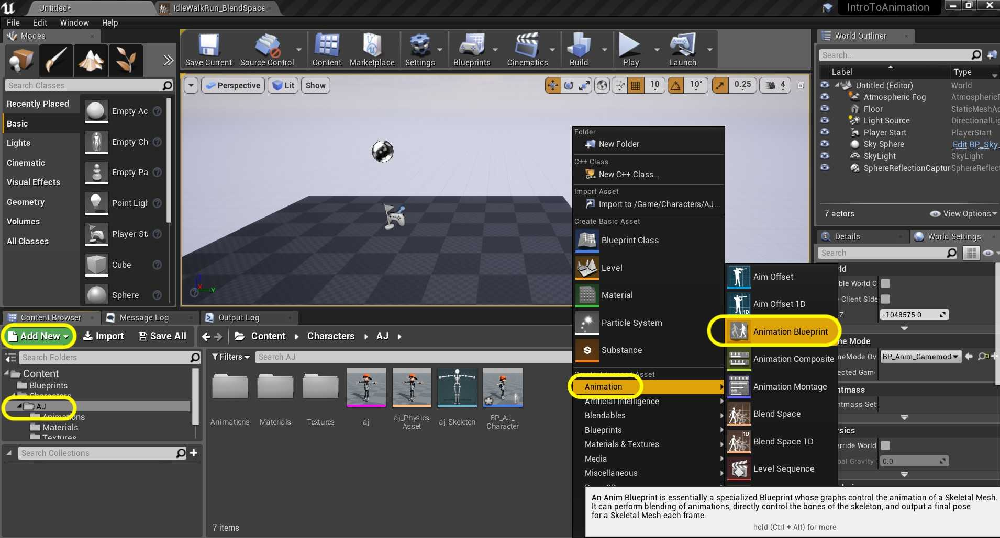

##### `Step 2.`\|`FHIU`|:small_blue_diamond: :small_blue_diamond: 

*Select* **AnimInstance** and then the skeleton that you imported. Press the <kbd>OK</kbd> button.

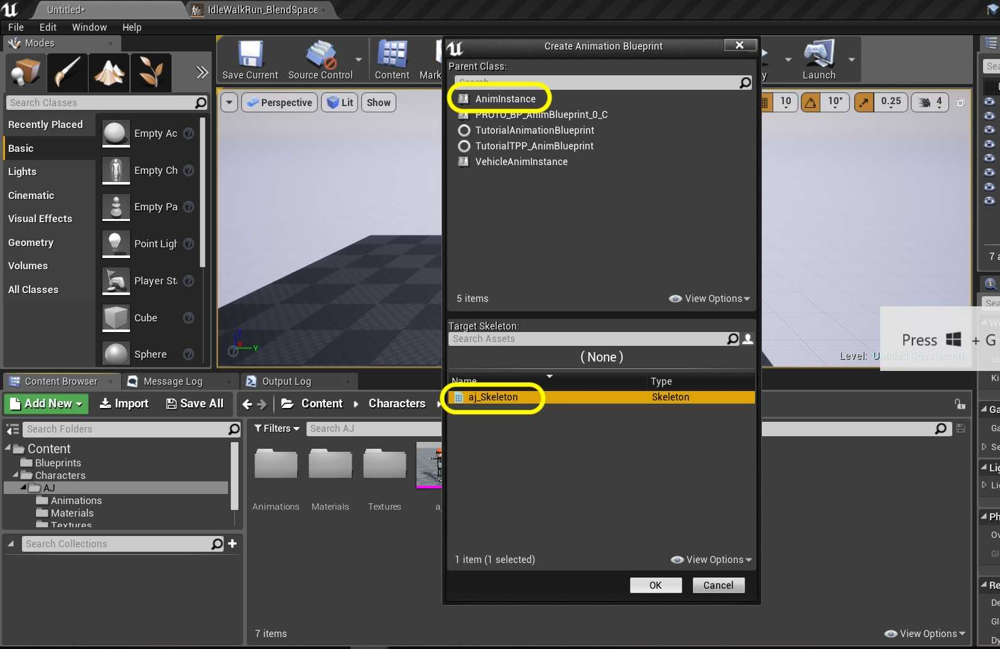

##### `Step 3.`\|`ITA`|:small_blue_diamond: :small_blue_diamond: :small_blue_diamond:

Name it `AJ_AnimBlueprint`.

##### `Step 4.`\|`ITA`|:small_blue_diamond: :small_blue_diamond: :small_blue_diamond: :small_blue_diamond:

Open the animation blueprint and go to the **AnimGraph** tab. If it is not there you can double click it in the **My Blueprint** tab on the left hand side.

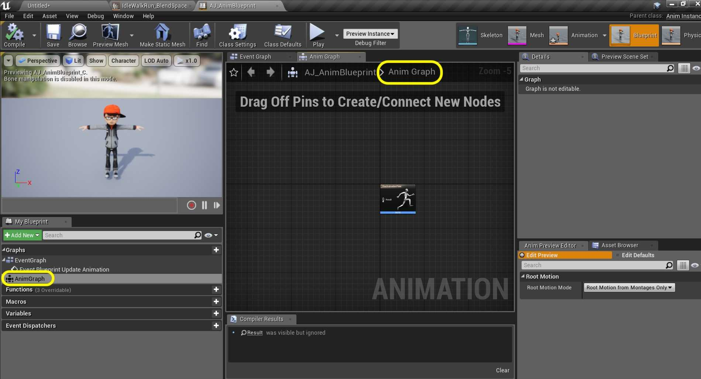

##### `Step 5.`\|`ITA`| :small_orange_diamond:

*Right click* on the anim graph and select a **Add New State Machine** node.

##### `Step 6.`\|`ITA`| :small_orange_diamond: :small_blue_diamond:

Name State Machine

Name this node `Basic Locomotion`.

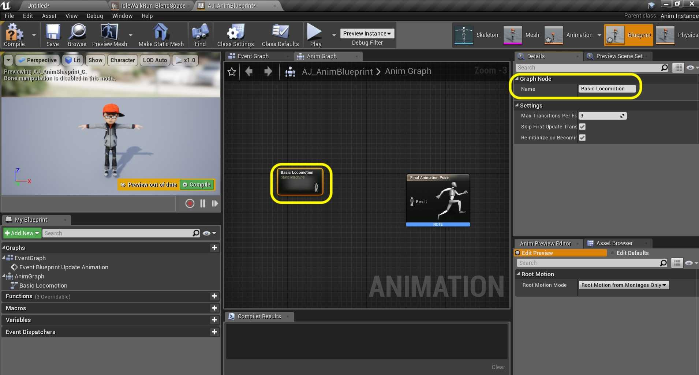

##### `Step 7.`\|`ITA`| :small_orange_diamond: :small_blue_diamond: :small_blue_diamond:

*Connect* the animation pins from the **Basic Locomotion** node to the **Final Animation Pose** node. *Double click* on the **Basic Locomotion** node to enter its state machine.

##### `Step 8.`\|`ITA`| :small_orange_diamond: :small_blue_diamond: :small_blue_diamond: :small_blue_diamond:

This gets us to the entrance of the Basic Locomotion animation tree. It has an **Entry** node that is what it plys when it enters this state (the only state we are calling for the moment)

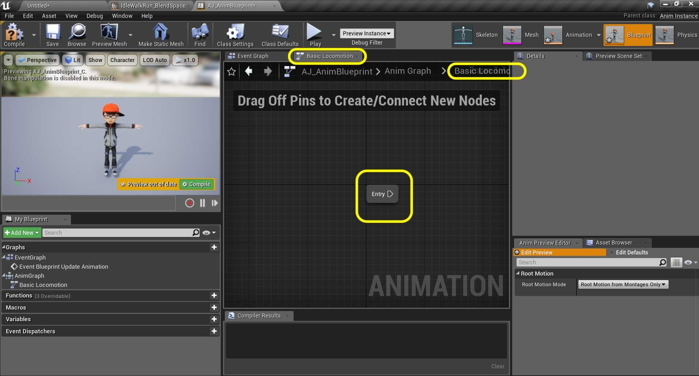

##### `Step 9.`\|`ITA`| :small_orange_diamond: :small_blue_diamond: :small_blue_diamond: :small_blue_diamond: :small_blue_diamond:

*Right click* on the anim graph and select **Add State.**

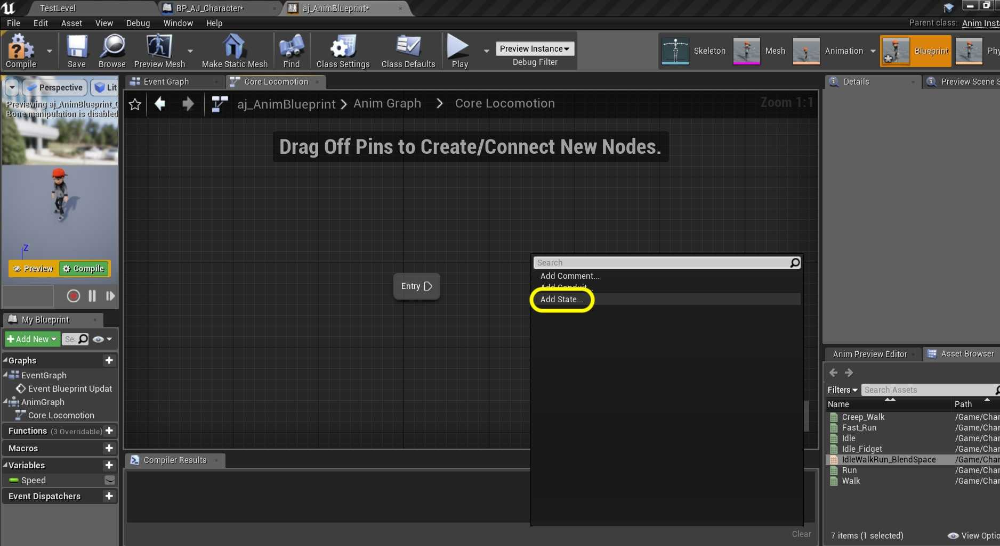

##### `Step 10.`\|`ITA`| :large_blue_diamond:

*Name* this state **IdleWalkRun** and *attach* the node from **Entry** to this new **State**. *Double click* on **IdleWalkRun** to enter this state.

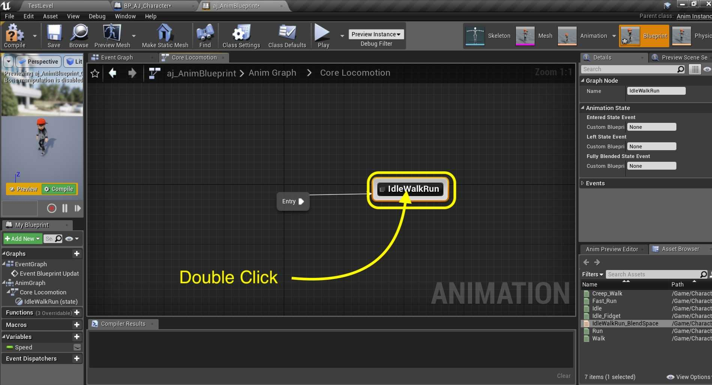

##### `Step 11.`\|`ITA`| :large_blue_diamond: :small_blue_diamond: 

Now we need to play the blend space we created. Drag and drop the **IdleWalkRun_BlendSpace** onto the graph.

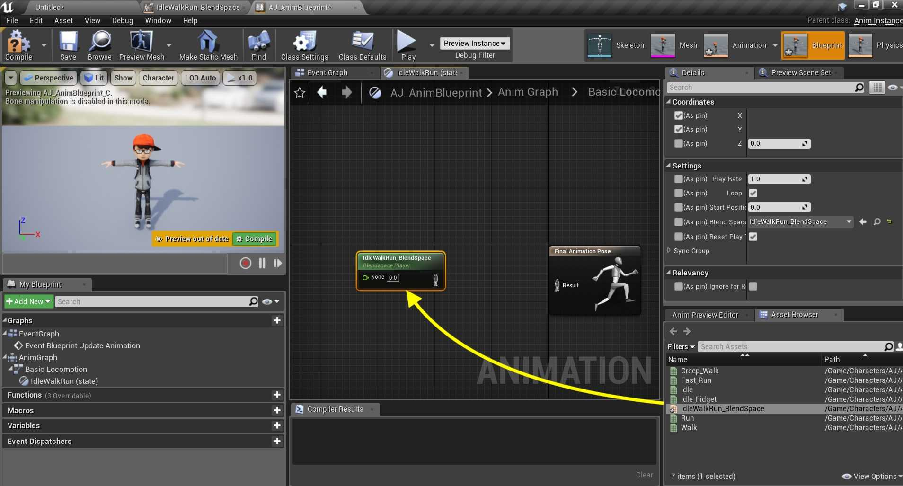

##### `Step 12.`\|`ITA`| :large_blue_diamond: :small_blue_diamond: :small_blue_diamond: 

*Connect* the animation pins so that this **blendspace** runs and gets sent to the **state machine**.

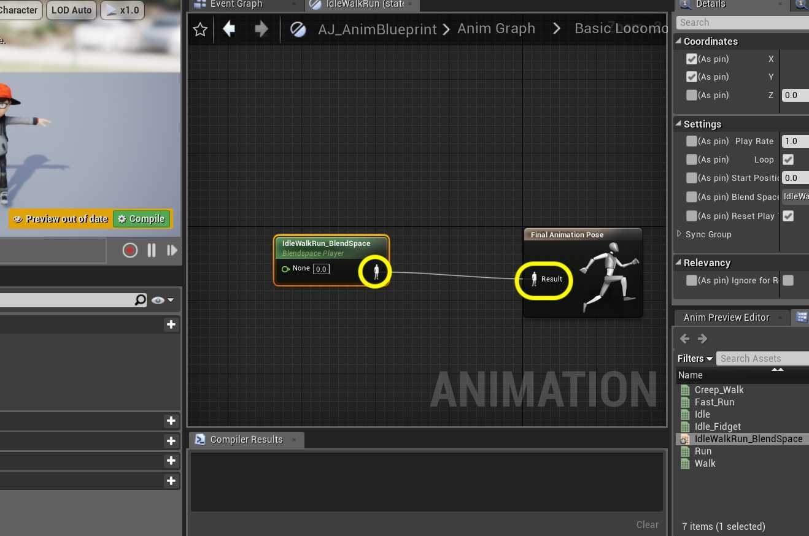

##### `Step 13.`\|`ITA`| :large_blue_diamond: :small_blue_diamond: :small_blue_diamond:  :small_blue_diamond: 

Now this blend space requires an input float to represent the speed of the player. *Right click* on **None** and select **Promote to Variable**.

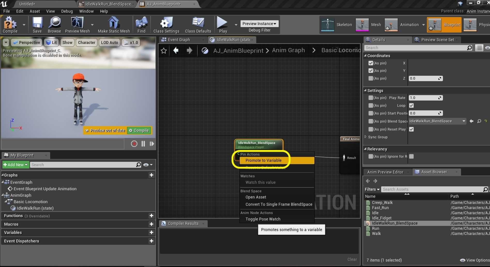

##### `Step 14.`\|`ITA`| :large_blue_diamond: :small_blue_diamond: :small_blue_diamond: :small_blue_diamond:  :small_blue_diamond: 

Name this variable `Speed` and set **Private** to `true`. *Press* the <kbd>Compile</kbd> button.

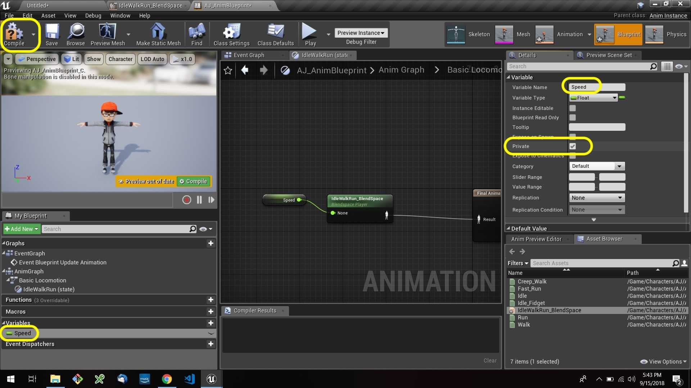

##### `Step 15.`\|`ITA`| :large_blue_diamond: :small_orange_diamond: 

We need to get access to the **Speed** of the player. We do this in the **Event Graph** of the animation blueprint. *Click on* the **Event Graph** tab (or *double click* it from the Graphs menu on the left) and you should see two *greyed* out nodes. If you don't see the **Try Get Pawn Owner** then add it. *Drag off* of the **Return Value** pin from the **Try Get Pawn Owner** node and selecdt a **? Is Valid** node. We want to make sure that this pawn is active in game.

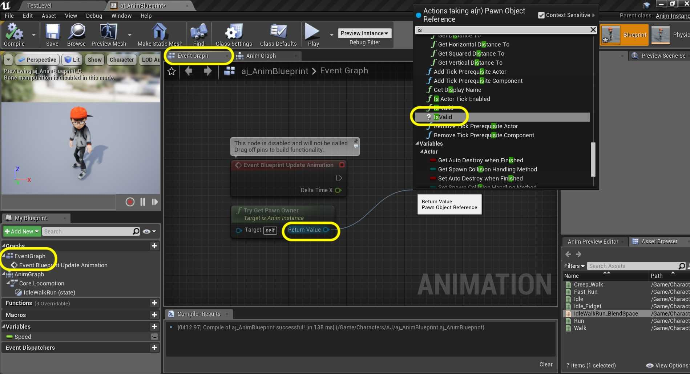

##### `Step 16.`\|`ITA`| :large_blue_diamond: :small_orange_diamond:   :small_blue_diamond: 

*Drag off* of the **Return Value** from the **Try Get Pawn Owner** node again and select **Get Velocity** to get the velocity vector of the player pawn.

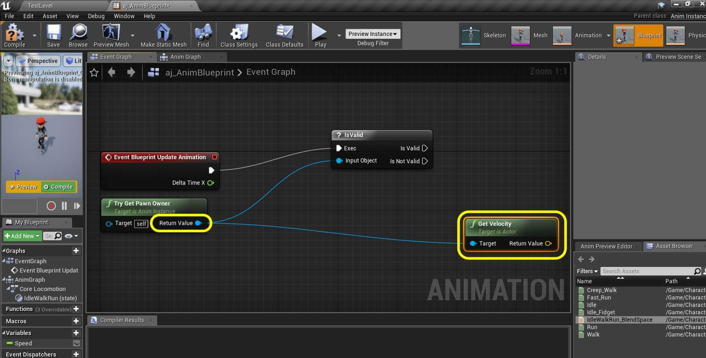

##### `Step 17.`\|`ITA`| :large_blue_diamond: :small_orange_diamond: :small_blue_diamond: :small_blue_diamond:

Now a **Velocity** (or any vector for that matter) has a *direction* and a *magnitude*. All we care about here is the *magnitude*. *Drag off* of the **Return Value** pin from the **Get Velocity** node and select **Vector Length** (I typed in Magnitude in the search window and it still points to this node!). This returns a float with the length of the vector (magnitude).

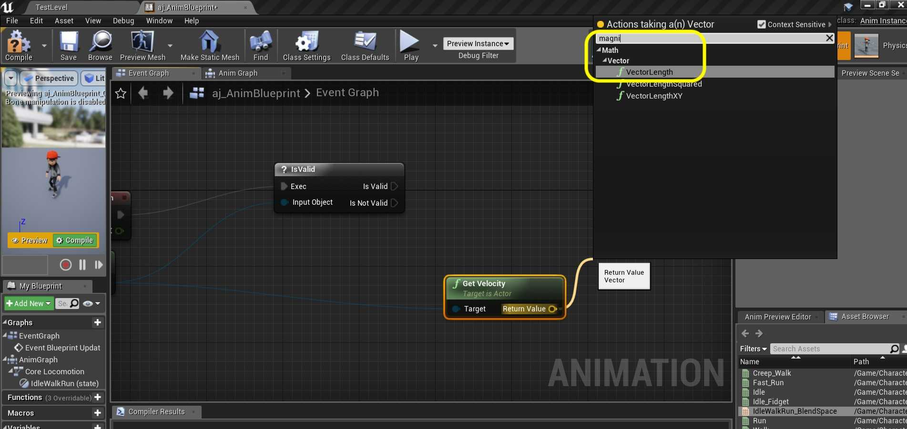

##### `Step 18.`\|`ITA`| :large_blue_diamond: :small_orange_diamond: :small_blue_diamond: :small_blue_diamond: :small_blue_diamond:

*Drag and drop* the **Speed Variable** and select **Set Speed**:

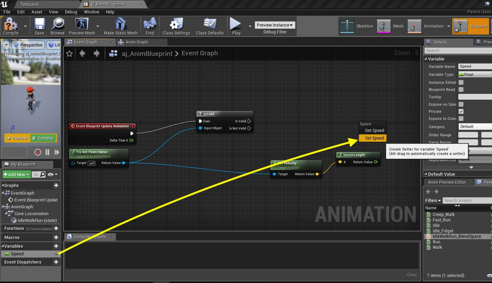

##### `Step 19.`\|`ITA`| :large_blue_diamond: :small_orange_diamond: :small_blue_diamond: :small_blue_diamond: :small_blue_diamond: :small_blue_diamond:

Connect the execution pins between the three nodes and *press* the <kbd>Compile</kbd> button.

##### `Step 20.`\|`ITA`| :large_blue_diamond: :large_blue_diamond:

Add a comment called `Get Speed From Player` to these nodes:

##### `Step 21.`\|`ITA`| :large_blue_diamond: :large_blue_diamond: :small_blue_diamond:

Add a **Maps** folder and save this level as `Test Level`. Make sure you are in this level.

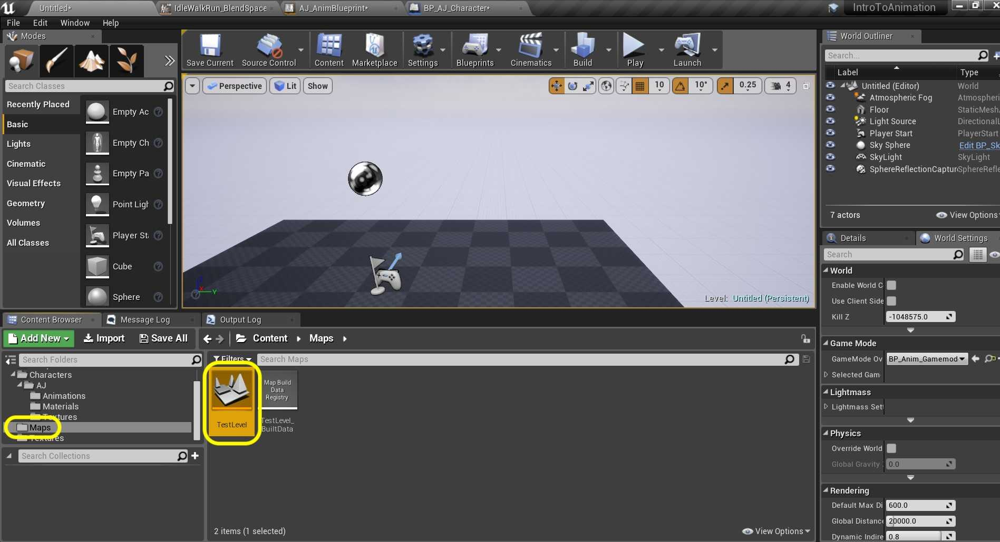

##### `Step 22.`\|`ITA`| :large_blue_diamond: :large_blue_diamond: :small_blue_diamond: :small_blue_diamond:

Now we need to assign this animation blueprint to our skeletal mesh. *Open* the **BP_AJ_Character** blueprint. *Go* to the **Viewport** tab. We notice our character is in a *T-Pose*. *Select* the **Animation Class** on the Details panel and pick the animation blueprint we just made **AJ_AnimBlueprint**. You will notice that the player should enter the idle state. *Press* the <kbd>Compile</kbd> button.

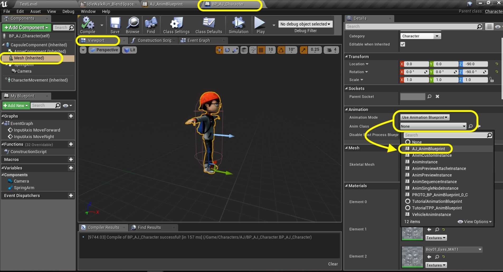

##### `Step 23.`\|`ITA`| :large_blue_diamond: :large_blue_diamond: :small_blue_diamond: :small_blue_diamond: :small_blue_diamond:

We want the player to face the direction we are moving in as opposed to always looking forward. Go to the top level component on the blueprint and under **Pawn** *set* the **Use Controller Rotation Yaw** to `false`.

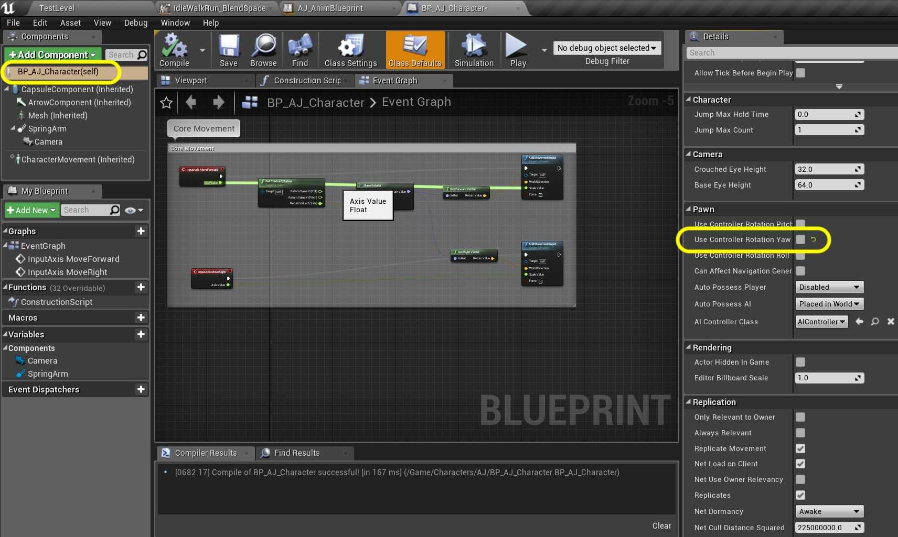

##### `Step 24.`\|`ITA`| :large_blue_diamond: :large_blue_diamond: :small_blue_diamond: :small_blue_diamond: :small_blue_diamond: :small_blue_diamond:

Now *select* the **Spring Arm** component and in **Camera Settings** *set* **Use Pawn Control Rotation** to `true`.

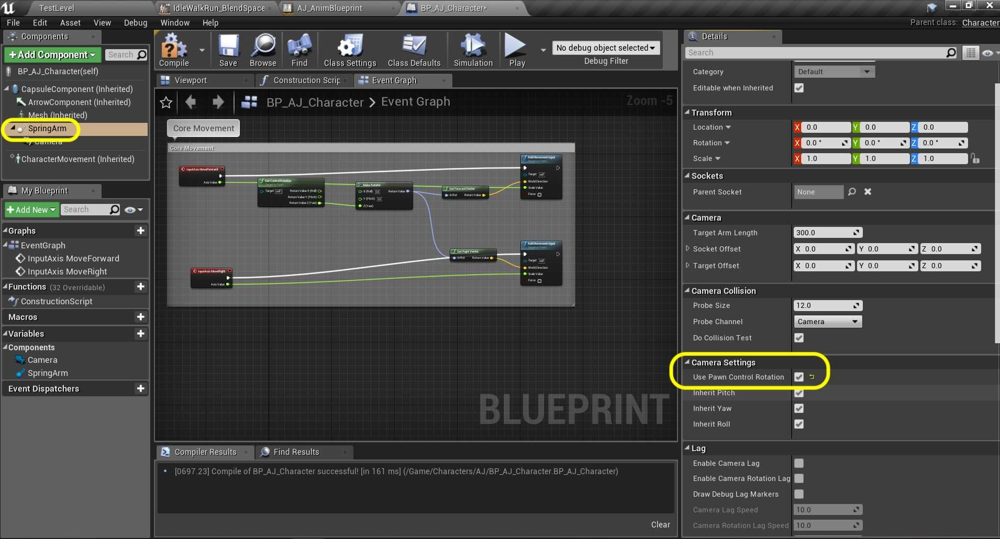

##### `Step 25.`\|`ITA`| :large_blue_diamond: :large_blue_diamond: :small_orange_diamond:

Now press the <kbd>Compile</kbd> button and go into the game and press *play*. You will notice that the player does animate but doesn't change directions.

##### `Step 26.`\|`ITA`| :large_blue_diamond: :large_blue_diamond: :small_orange_diamond: :small_blue_diamond:

Now go back to the **BP_AJ_Character** blueprint and *select* the **CharacterMovement** component. *Scroll* in the **Details** panel down to C**haracter Movement (Rotation Settings)** tab. Open it up and look for **Orient Rotation to Movement**. Set this to *true*.

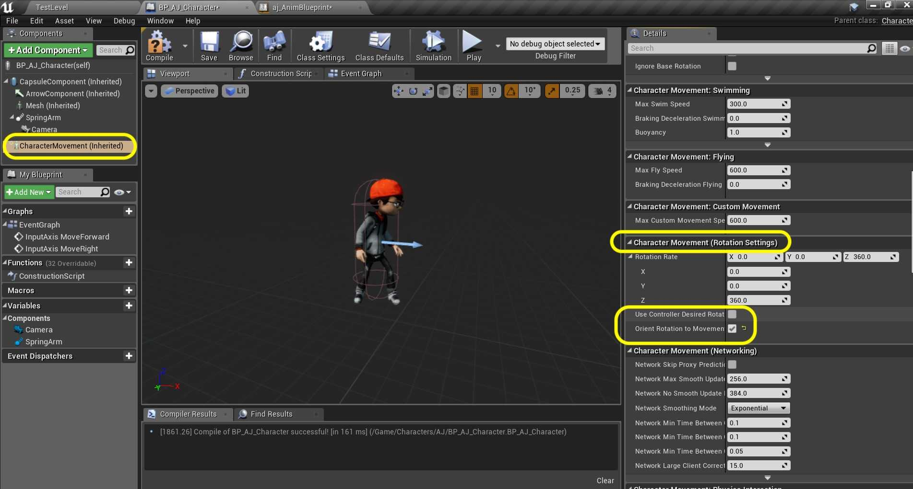

##### `Step 27.`\|`ITA`| :large_blue_diamond: :large_blue_diamond: :small_orange_diamond: :small_blue_diamond: :small_blue_diamond:

Now press the <kbd>Compile</kbd> button and go back into the game. Now the player should animate and turn correctly. *Press* **Save All** and update **Github** by committing and pushing all the changes made. 

___

| [previous](../animation-blend/README.md#user-content-animation-blend-space)| [home](../README.md#user-content-ue4-animations) | [next](../second-idle/README.md#user-content-time-out-for-second-idle)|
|---|---|---|
